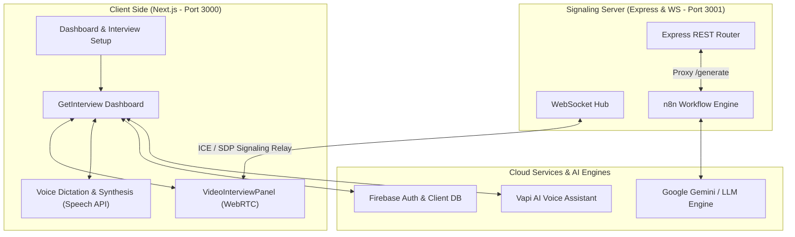

# 🤖 InterPrep — Precision in Recruitment


## 🌟 Overview
**InterPrep** is a premium, next-generation AI-powered mock interview platform designed to help students and professionals prepare for technical and behavioral interviews in a hyper-realistic environment. 

By eliminating static form-based templates, InterPrep provides a **voice-first, natural interface** where candidates speak directly to Chloe, their virtual AI Recruiter. Built to replicate high-stakes corporate screening procedures, the platform generates personalized, resume-aligned questions, manages a secure live-stream peer panel using peer-to-peer WebRTC connections, and delivers comprehensive, structured evaluation reports in real-time.

---

## 🏗️ Architecture & Data Flow

Below is the conceptual architecture of how the frontend UI, custom signaling gateway, external AI APIs, and workflows integrate:



---

## ⚡ Real-Time WebSockets & WebRTC Signaling Blueprint

In a WebRTC environment, media data flows directly between candidate and peer browsers (peer-to-peer). However, to establish this peer-to-peer channel, the participants must exchange connection metadata (SDP offers, answers, and ICE candidates) through a server. This process is called **Signaling**, and **WebSockets** are the perfect vehicle for this low-latency transaction.

### 🔄 Signaling Sequence Flow
Below is the signaling sequence executed by InterPrep when initiating an interactive WebRTC video session:

```mermaid
sequenceDiagram
    autonumber
    actor User as Candidate (Next.js)
    actor Interviewer as AI/Interviewer
    participant Sig as Express WS Signaling Server (Port 3001)

    User->>Sig: Establish WebSocket Connection
    Interviewer->>Sig: Establish WebSocket Connection
    
    rect rgb(20, 30, 25)
        note right of User: Step 1: Media Negotiation
        User->>Sig: Send "SDP Offer" (I want to stream video/audio)
        Sig->>Interviewer: Relay "SDP Offer"
        Interviewer->>Sig: Send "SDP Answer" (I accept, here is my stream)
        Sig->>User: Relay "SDP Answer"
    end

    rect rgb(25, 20, 20)
        note right of User: Step 2: Network Pathfinding (ICE Candidates)
        User->>Sig: Send ICE Candidate (My network path options)
        Sig->>Interviewer: Relay ICE Candidate
        Interviewer->>Sig: Send ICE Candidate (My path options)
        Sig->>User: Relay ICE Candidate
    end

    rect rgb(15, 30, 35)
        note right of User: Step 3: Direct WebRTC P2P Media Stream
        User-->>Interviewer: Peer-to-Peer Media Connection (Audio, Video, Data Channel)
    end
```



---

## 🔌 Core Implementation Reference

### 1. Backend Upgrades: WebSockets in Express
Our Node.js Express server is upgraded to wrap the HTTP listener and attach the ultra-lightweight `ws` WebSocket library. This manages active signaling rooms and matches SDP descriptors:

```typescript
// Located inside backend/server.ts
const wss = new WebSocketServer({ server });
const activeRooms = new Map<string, Set<WebSocket>>();

wss.on("connection", (ws) => {
  let userRoom: string | null = null;
  ws.on("message", (message: string) => {
    const data = JSON.parse(message);
    switch (data.type) {
      case "join-room":
        userRoom = data.roomId;
        if (!activeRooms.has(userRoom!)) activeRooms.set(userRoom!, new Set());
        activeRooms.get(userRoom!)?.add(ws);
        break;
      case "offer":
      case "answer":
      case "ice-candidate":
        if (userRoom && activeRooms.has(userRoom)) {
          activeRooms.get(userRoom)?.forEach((client) => {
            if (client !== ws && client.readyState === WebSocket.OPEN) {
              client.send(JSON.stringify(data));
            }
          });
        }
        break;
    }
  });
});
```

### 2. Frontend Integration: Custom WebRTC Hook
A highly responsive React Hook handles camera permissions, socket states, stream binding, and lifecycle cleanups safely in the browser:

```typescript
// Located inside hooks/useWebRTC.ts
export const useWebRTC = ({ roomId, wsUrl }: WebRTCOptions) => {
  const [localStream, setLocalStream] = useState<MediaStream | null>(null);
  const [remoteStream, setRemoteStream] = useState<MediaStream | null>(null);
  const [connectionStatus, setConnectionStatus] = useState<"disconnected" | "connecting" | "connected" | "failed">("disconnected");
  // Manage RTCPeerConnection and WebSocket events dynamically...
};
```

---

## ✨ Key Features

### 1. 📹 Interactive Video Assessment (WebRTC)
- **Live Peer Streams**: Real-time simulated peer-feed integration using a peer-to-peer WebRTC architecture.
- **Dynamic Control Hub**: Candidates can easily toggle camera (`Video`) and microphone (`Mic`) inputs directly within the feed container.
- **Resilient Signaling**: Custom Express-based WebSocket connection relaying Session Description Protocol (SDP) offers, answers, and ICE candidates dynamically.
- **Intelligent Error States**: Automatic server health checks and offline troubleshooting instructions in the client grid to guide developers.

### 2. 🗣️ Hands-Free Voice-First Interview Engine
- **Voice Dictation**: Uses continuous Web Speech Recognition (`webkitSpeechRecognition`) to let candidates naturally vocalize their responses.
- **Speech Synthesis**: Interactive Text-to-Speech (TTS) engine that reads questions out loud using natural, optimized English voice personas.
- **Interactive Recruiter Avatar**: Animated wave states and mic indicators that pulse synchronously with Chloe's speech and listening statuses.

### 3. 🤖 Resume-Tailored AI Generation
- **Targeted Questioning**: Creates customized, domain-specific interview sets based on user level (Junior, Mid, Senior), candidate tech stack, and interview types (Technical, Behavioral, HR).
- **LLM-Powered Orchestration**: Orchestrated by a powerful **n8n workflow pipeline** proxying backend queries to **Google Gemini**.

### 4. 📝 Real-Time Interactive Grading Reports
- **Detailed Evaluation Sheets**: Instant grading reports compiling scores, detailed strengths, and tailored growth metrics at the conclusion of each session.

### 5. 🔐 Robust Security & Auth
- **Firebase Core Auth**: Secure password/email authentication flow.
- **Firebase Admin SDK**: Safe database writing and administrative functions.

---

## 🛠️ Tech Stack

* **Frontend**: Next.js 16 (App Router), React 19, Tailwind CSS, Lucide Icons, Shadcn/UI, LiveKit Client.
* **Backend**: Node.js, Express, WebSocket (`ws`), TypeScript, `tsx`.
* **Database & Auth**: Firebase Auth, Firebase Admin SDK.
* **AI Pipelines**: Google Gemini (`@ai-sdk/google`), Vapi AI, n8n automation webhook.

---

## 🤸 Quick Start

Follow these steps to set up the project locally on your machine.

### 1. Clone & Install Dependencies

**Install Frontend Dependencies (Root Folder):**
```bash
npm install
```

**Install Backend Dependencies (Backend Folder):**
```bash
cd backend
npm install
cd ..
```

---

### 2. Set Up Environment Variables

#### Root Frontend `.env.local`
Create a `.env.local` file in the root directory and append the following credentials:
```env
NEXT_PUBLIC_VAPI_WEB_TOKEN=your_vapi_token
NEXT_PUBLIC_VAPI_WORKFLOW_ID=your_vapi_workflow_id

GOOGLE_GENERATIVE_AI_API_KEY=your_google_gemini_key

NEXT_PUBLIC_BASE_URL=http://localhost:3000
NEXT_PUBLIC_WS_URL=ws://localhost:3001

NEXT_PUBLIC_FIREBASE_API_KEY=your_firebase_key
NEXT_PUBLIC_FIREBASE_AUTH_DOMAIN=your_auth_domain
NEXT_PUBLIC_FIREBASE_PROJECT_ID=your_project_id
NEXT_PUBLIC_FIREBASE_STORAGE_BUCKET=your_bucket_id
NEXT_PUBLIC_FIREBASE_MESSAGING_SENDER_ID=your_sender_id
NEXT_PUBLIC_FIREBASE_APP_ID=your_app_id

FIREBASE_PROJECT_ID=your_firebase_project_id
FIREBASE_CLIENT_EMAIL=your_firebase_client_email
FIREBASE_PRIVATE_KEY=your_firebase_private_key
```

#### Backend `.env`
Create a `.env` file in the `/backend` directory:
```env
PORT=3001
N8N_WEBHOOK_URL=http://localhost:5678/webhook-test/generate-interview
```

---

### 3. Running the Project Locally

To run InterPrep, you must spin up both the Next.js frontend client and the Express signaling server.

#### A. Start the Backend Server (Signaling Gateway)
```bash
cd backend
npm run dev
```
*The signaling gateway will spin up on `ws://localhost:3001`.*

#### B. Start the Frontend Client (Next.js Application)
Open a new terminal at the root directory and run:
```bash
npm run dev
```
*The client-side UI will start at [http://localhost:3000](http://localhost:3000).*

---

## 🔮 Gemini 2.0 Multimodal Live API (Alternative Path)

> [!NOTE]  
> If your mock interview is fully automated (not P2P between two humans), the absolute best way to utilize WebSockets is the **Gemini Multimodal Live API**.
>
> Instead of routing peer-to-peer through an intermediate node backend, you establish a **WebSocket connection directly from the browser to Gemini**:
> - Send direct PCM audio chunks from the candidate microphone over WebSocket.
> - Gemini stream-responds with PCM audio chunks immediately (voice response).
> - Lowers latency to **< 500ms**, creating a 100% fluent, human-like voice interview by bypassing the local speech-to-text / text-to-speech engine entirely!

---

## 🤝 Contributions

Contributions are welcome! Please feel free to open a Pull Request or issue if you'd like to:
- 🎨 Enhance the Glassmorphism styling and UI micro-interactions.
- 🧠 Optimize WebRTC peer candidate negotiation speeds.
- 🚀 Integrate custom postures or speech analytics feedback.

---

## 📜 License
This project is licensed under the **MIT License**.

---

### **🎉 Happy Coding & Best of Luck for Your Interviews! 🚀**
# InterPrep
# InterPrep
# InterPrep
